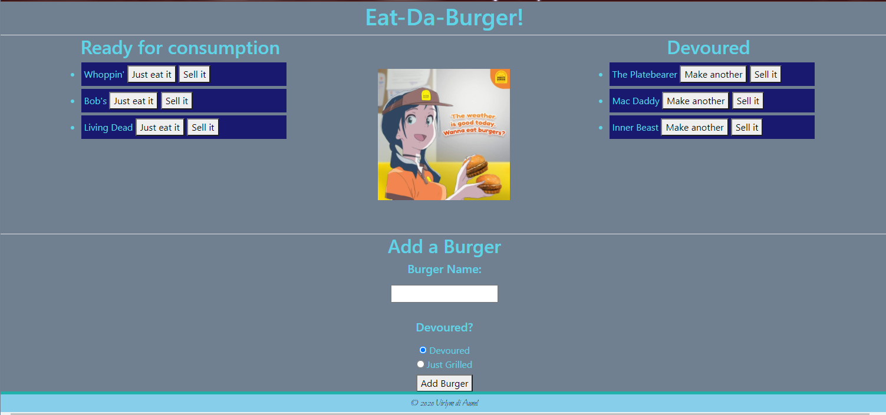

# **hw13-handlebar-burger-express**
  
  
  
  ## **Description**
  
  A burger logger utilizing MySQL, Node, Express, Handlebars and an ORM following the MVC design pattern. Users can input the names of burgers they'd like to eat or have eaten. Each burger name will have two buttons attached to it. One will be either 'Just eat it' or 'make another', which will allow the burger to swap between the left and right sides. And another button to remove the burger from the list completely. The burgers are stored in a database so the information will persist even on a different device.
  <br><br>
  
  ## **Table of Contents**
  
  * [Installation](#Installation)
  * [Usage](#Usage)
  * [License](#License)
  * [Contributing](#Contributing)
  * [Technology](#Technology)
  * [Questions](#Questions)
  
  <br><br>
  
  ## **Installation**
  
  1. Clone the repo
  ```sh
  git clone https://github.com/virlym/hw13-handlebar-burger-express.git
  ``` 
  2. Install NPM packages
  ```sh
  npm install
  ```
  <br><br>
  
  ## **Usage**

  [Deployed Link](https://hw13-handlebar-burger-express.herokuapp.com/)

  

  <br><br>
  
  ## **License**
  
  Distributed under the MIT License.
  <br><br>
  
  ## **Contributing**
  Contributions are what make the open source community such an amazing place to be learn, inspire, and create. Any contributions you make are **greatly appreciated**.
  
  1. Fork the Project
  2. Create your Feature Branch (`git checkout -b feature/AmazingFeature`)
  3. Commit your Changes (`git commit -m 'Add some AmazingFeature'`)
  4. Push to the Branch (`git push origin feature/AmazingFeature`)
  5. Open a Pull Request
  
  <br><br>
  
  ## **Technology**
  - [JavaScript](https://www.javascript.com/)
  - [npm MySQL](https://www.npmjs.com/package/mysql)
  - [npm Express](https://www.npmjs.com/package/express)
  - [npm Express-Handlebars](https://www.npmjs.com/package/express-handlebars)
  - [Node.js](https://nodejs.org/en/)
  <br><br>
  
  ## **Questions**
  Learn about more of my work at [my GitHub](https://github.com/virlym)
  
  You can send any additional questions to my email : virlym@gmail.com
  <br><br><br><br>